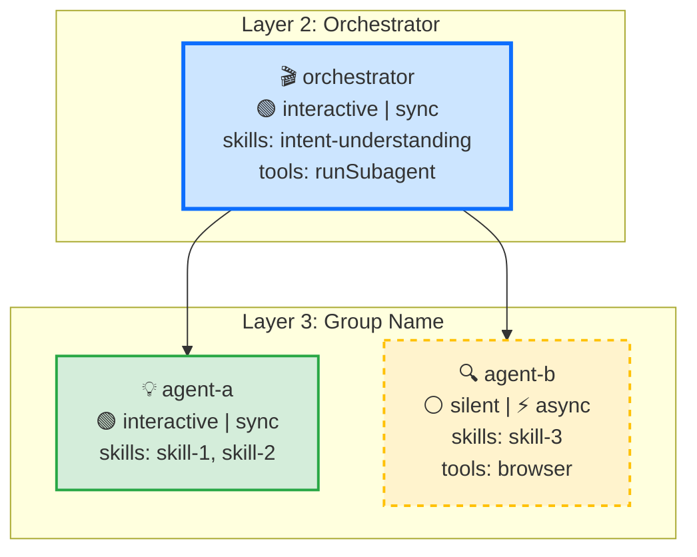
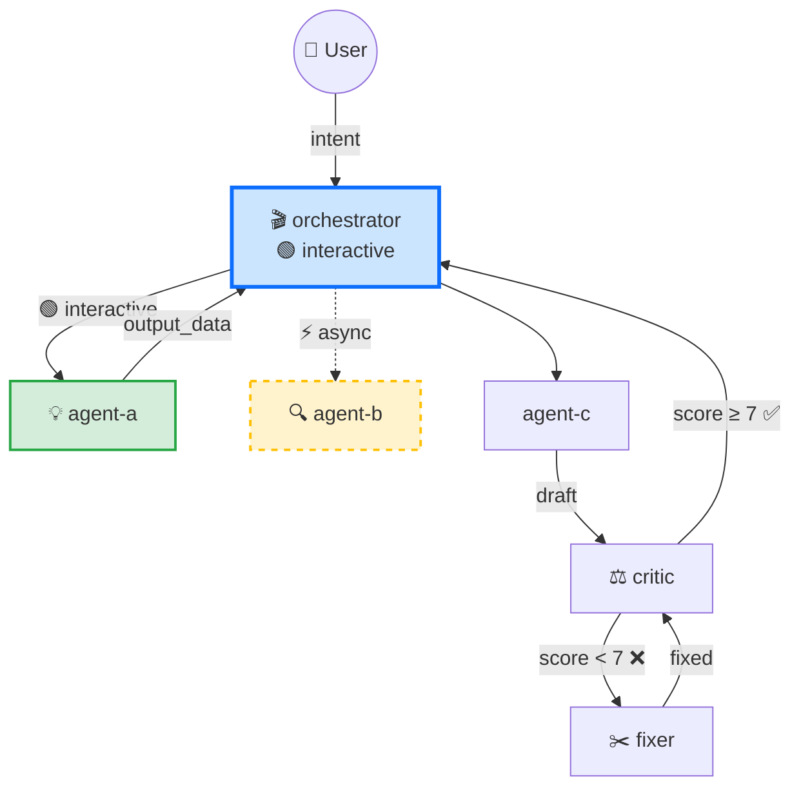

# AI App Architect — 5-Layer Pattern

A universal framework for designing AI-era applications. Any app where an AI agent helps users accomplish goals can be structured using this pattern.

## The Pattern

```
Layer 1: User Interface      — How the user talks to the system
Layer 2: Orchestrator Agent   — Main session, understands intent, coordinates
Layer 3: Sub-Agents          — Autonomous workers with specific goals
Layer 4: Skills              — Reusable capabilities (functions)
Layer 5: Tools               — Raw primitives (APIs, SDKs, CLIs)
```

**The formula**: Idea → define each layer → user talks to orchestrator → orchestrator spawns sub-agents → sub-agents use skills → skills use tools → results flow back up.

## Core Law: Markdown-First I/O

Every agent-to-agent boundary uses **Markdown** — not JSON, not TypeScript, not YAML.

- **Agent output** → Markdown (tables, lists, headings). LLMs produce and consume this natively.
- **State on disk** → `.md` files. Agents read/write with `read_file`/`create_file`. No `jq`, no JSON parsing.
- **Orchestrator ↔ sub-agent** → Markdown strings passed via `runSubagent` prompt/result.
- **Only exceptions**: Tool input formats that require structured data (e.g., Remotion `props.json`, API payloads). These are machine-to-machine boundaries, not agent boundaries.

**Why**: The entire app flow is LLM-consumed. JSON adds parsing overhead agents don't need. Markdown is the universal format LLMs read and write fluently. State files become human-reviewable documentation for free.

**Rule**: If an agent produces it or consumes it, it's Markdown. If a CLI tool or API requires it, it can be JSON/YAML.

## When to Use

- Starting a new AI-powered app or project
- Turning a vague product idea into a buildable architecture
- Deciding what agents/skills to build
- Structuring a complex AI workflow
- Any project where "an AI helps the user do X"

## When NOT to Use

- Simple single-purpose tools (just write the tool)
- Non-AI projects
- Projects where the user doesn't interact with an agent

## The 5 Layers Explained

### Layer 1: User Interface
How the user communicates with the system.

**Examples**: Chat, voice, camera, file picker, preview player, dashboard

**Key question**: What does the user SEE and DO?

### Layer 2: Orchestrator Agent
The main agent session. User-facing. Single point of contact.

**Responsibilities**:
- Understand user intent ("I want to make a video" → what kind? what materials? what platform?)
- Choose strategy (which sub-agents to spawn, in what order)
- Show status ("Working on your video... Hook scored 4.8, rewriting...")
- Ask for decisions ("Here are 3 topic suggestions. Which one?")
- Coordinate sub-agent outputs

**Key insight**: The orchestrator does NOT do the work. It coordinates. Like a project manager.

**Key question**: What decisions does the orchestrator make?

### Layer 3: Sub-Agents
Autonomous workers, each with a specific goal. Spawned by orchestrator.

**Properties**:
- Has a clear **goal** (find topics, create video, evaluate quality)
- Has **autonomy** — runs independently, makes decisions within scope
- Uses **multiple skills** to achieve its goal
- Returns **structured output** to orchestrator

**I/O Contract** (define for each sub-agent):
- **Input**: Markdown from orchestrator or from disk (`.md` files). Never raw JSON.
- **Output**: Markdown — tables, lists, headings. Also saves to disk as `.md` files.
- **Sync/Async**: does orchestrator wait for result, or fire-and-forget?
- **Skippable**: can this agent be skipped without breaking the flow?
- **Dependencies**: does it need output from another agent first?
- **Interactive**: does this agent talk to the user, or run silently?
  - `interactive: true` — agent can ask questions, show progress, request decisions (e.g., brainstorm helper, orchestrator)
  - `interactive: false` — agent runs silently and returns result to orchestrator (e.g., critic, assembler)
  - Most sub-agents are NON-interactive. The orchestrator is the user's single point of contact.
  - Interactive sub-agents should be rare — too many user-facing agents creates confusion.

**I/O Contract Example**:
```
Content Critic
  Input:  Markdown draft from Content Creator (read from posts/{id}/draft.md)
  Output: Markdown: score table + issues list + pass/fail verdict
  Sync:   Yes — orchestrator blocks until score returned
  Skippable: No (quality gate)
  Dependencies: Requires output from Content Creator
  Interactive: No — runs silently, returns score

Alert Monitor
  Input:  schedule.md (read from disk) + platform URLs
  Output: Markdown: metrics snapshot table + classified comments list
  Sync:   No — runs in background, pushes alerts
  Skippable: Yes — feature degrades gracefully
  Dependencies: None
  Interactive: No — background process
```

**Key question**: What are the distinct JOBS in this workflow?

### Async Agent Execution
When sub-agents run async or in parallel, the orchestrator must handle:
1. **Timeout** — define max wait per agent (e.g., 30s). Fallback if exceeded (skip, use cached, ask user)
2. **State isolation** — async agents must not read/write each other's state. Each writes to its own output key
3. **Result composition** — how to merge results from parallel agents (first wins? merge? majority vote?)
4. **Partial failure** — one agent fails, others succeed. Can orchestrator proceed with partial results?

**Example**: Photo Enhancer and SEO Optimizer run in parallel. Each writes its own output (`enhanced_photos`, `seo_keywords`). Orchestrator waits for both, then passes both to Copywriter. If Photo Enhancer times out, use original photos.

### Skill vs Sub-Agent: Decision Tree
```
Does this component...
  ├── Make complex sequential decisions? → Sub-Agent
  ├── Maintain state during execution? → Sub-Agent
  ├── Need to invoke other agents? → Sub-Agent
  ├── Have a single clear input → output? → Skill
  ├── Get called by multiple agents? → Skill
  └── Could be a pure function? → Skill
```
**Rule of thumb**: Sub-agents are mini-orchestrators at their level. Skills are functions.
If a "skill" has 10+ steps and makes decisions, it's probably a sub-agent.
If a "sub-agent" does one thing and returns one result, it's probably a skill.

### Layer 4: Skills
Reusable capabilities. Like functions. Stateless. Called by sub-agents.

**Properties**:
- Single responsibility (score a hook, assemble video, browse platform)
- Composable — sub-agents combine multiple skills
- Reusable — multiple sub-agents can use the same skill
- Testable — clear input → output

**Key question**: What are the CAPABILITIES needed? (not who uses them — that comes from sub-agents)

### Layer 5: Tools
Raw primitives. The lowest level. APIs, SDKs, CLIs, hardware.

**Properties**:
- Not AI-specific (ffmpeg, camera SDK, database, file system)
- Skills wrap tools to add intelligence
- Platform-dependent (iOS SDK, web APIs, etc.)

**Key question**: What TECHNICAL CAPABILITIES does the platform provide?

## Procedure: Designing an AI App

### Phase 1: Define Roles (Who does what?)

#### Step 1: Define the Idea (1 sentence)
"An AI that helps users [DO WHAT] by [HOW]"

#### Step 2: Identify Role Agents (Layer 3)
Think about ROLES, not features. Each distinct job = one agent.
Ask: "If I had a team of specialists, who would I hire?"

For each role agent, define:
- **Name**: descriptive role name
- **Goal**: one sentence
- **When called**: what triggers it
- **Output**: what it returns

**Always include a quality gate agent.** Every non-trivial output needs a critic/reviewer:
- Content creation → content critic (scores + specific fixes)
- Data analysis → fact checker (verifies claims against sources)
- Code generation → code reviewer (checks correctness + style)
- Research → synthesis reviewer (checks coverage + contradictions)

Without a critic, the system ships first-draft quality. The adversarial loop (creator → critic → rewriter) is what elevates output from "AI-generated" to "AI-refined."

#### Step 3: Define the Orchestrator (Layer 2)
The orchestrator coordinates role agents. Define:
- What INTENTS does it understand?
- Which agents to spawn for each intent?
- What STATUS does it show the user?
- What DECISIONS does it ask the user?

### Phase 2: Define Responsibilities (What does each agent need?)

#### Step 4: For Each Role Agent — Identify Responsibilities
Detail what each agent actually does. Define its procedure step by step.

#### Step 5: For Each Role Agent — Find Required Skills
For each responsibility from Step 4, systematically extract skills:

1. **Ask**: "What capability does this responsibility need?" → brainstorm 2-3 candidate skills
2. **Check**: Does this skill already exist in `.github/skills/`? Can it be built simply?
3. **Classify**: Is it reusable (used by 2+ agents) or agent-specific?
4. **Build a skill-to-agent matrix**:
   ```
   Skill              | Agent A | Agent B | Agent C | Shared?
   -------------------|---------|---------|---------|--------
   keyword-research   |    ✓    |         |    ✓    |  Yes
   score-hook         |         |    ✓    |         |  No
   platform-browsing  |    ✓    |         |    ✓    |  Yes
   ```
5. **Merge**: If two candidate skills always run together, merge into one. If one skill does 3+ unrelated things, split it.

#### Step 6: For Each Role Agent — Find Required Tools
What raw PRIMITIVES does each skill need? (APIs, SDKs, CLIs, hardware)

#### Step 6.5: Search Inventories (REQUIRED)
Before implementing anything, check if agents or skills already exist:

1. **Search [The Agency](https://github.com/msitarzewski/agency-agents)** (144+ agents across 12 divisions):
   - Browse the roster for agents matching your role agents
   - Adapt existing agent prompts/workflows instead of writing from scratch
   - Check their deliverables, success metrics, and communication style

2. **Search [ClawHub](https://clawhub.ai)** (49,000+ skills):
   - Search by keyword for each skill in your inventory
   - Install relevant skills
    - use `agent-browser` to operate chrome to search -> download-> unzip
        - DON'T `npx clawhub@latest install <skill>`
   - Check skill quality: stars, downloads, security scan

3. **Check your workspace**: browse `.github/skills/` for existing skills

**For each agent/skill you find**: decide adopt (use as-is), adapt (modify for your domain), or skip (build your own). Document the decision.

**Do NOT skip this step.** Building from scratch when a tested solution exists wastes effort and misses community-validated patterns.

### Phase 3: Implement Definitions

#### Step 6.75: Visualize Topology with Mermaid (REQUIRED before implementation)
Before writing any agent files, generate **two** Mermaid charts. Present both to the user for discussion and approval.

**Why**: Visual topology catches routing mistakes, missing agents, and unclear flows BEFORE you write 13+ files. One chart is worth 100 lines of description.

**Chart 1: Agent Topology (overview)**
Shows all agents grouped by category with their capabilities.


**Chart 2: Orchestrator Workflow (role-to-role flow)**
Shows data flow with I/O labels, adversarial loops, and async indicators.


**Color legend** (use in both charts):
- 🔵 Blue = orchestrator
- 🟢 Green = interactive (talks to user)
- 🟡 Yellow dashed = async (background)
- ⚪ Gray = silent sync worker

**Rules**:
- Chart 1: Group agents into subgraphs by function. Show all frontmatter fields (interactive/async, skills, tools).
- Chart 2: Show actual data flow with labeled edges. Use solid lines for sync, dashed for async. Include adversarial loops.
- Both charts: Use the color legend consistently.

**Present to user**: "Here are the two topology charts. Chart 1 shows each agent's capabilities. Chart 2 shows the data flow. Does this make sense?"

**Only proceed to Step 7 after user approves the topology.**

#### Step 6.9: Architecture Review (REQUIRED before implementation)
Run the review checklist in `review.md` (same folder as this SKILL.md).
Key checks:
- **Skill bloat**: If you listed more than 15 skills, most are capabilities, not skills. Run the 3-question litmus test.
- **Agent count**: 13+ agents = RED FLAG. Can any be merged?
- **Interactive agents**: Only orchestrator should be interactive (usually).
- **Missing quality gate**: Every primary output needs a critic.

Present review findings to user. Fix issues before proceeding to implementation.

#### Step 7: Implement Agent Files (.github/agents/)
Create `.agent.md` for orchestrator + each role agent.

**YAML frontmatter** (only VS Code supported fields):
```yaml
---
name: agent-name
description: "What this agent does."
---
```

**Body** starts with a `## Meta` section for metadata not supported in VS Code frontmatter.
Format these as frontmatter-style key-value pairs inside fenced code:

```markdown
## Meta
```
model: claude-sonnet-4-20250514
tools: run_in_terminal, read_file, create_file
skills: agent-browser, platform-browse
sync: true
interactive: false
skippable: false
```
```

**Meta fields**:
| Field | Values | Description |
|-------|--------|-------------|
| `model` | LLM model name | Which model to use |
| `tools` | comma-separated tool names | Tools this agent needs |
| `skills` | comma-separated skill names | Skills this agent references |
| `sync` | `true` / `false` | `true` = orchestrator waits for result, `false` = fire-and-forget |
| `interactive` | `true` / `false` | `true` = talks to user, `false` = runs silently |
| `skippable` | `true` / `false` | `true` = can be skipped without breaking flow |

Omit fields that don't apply (e.g., critic has no tools or skills).

**Why this format**: VS Code Copilot only supports `name` and `description` in `.agent.md` frontmatter. Other keys (`model`, `tools`, `skills`) are silently ignored or cause errors. Putting them in a `## Meta` section documents the agent's needs in a parseable, frontmatter-like format without breaking VS Code.

The rest of the body is the agent's system instruction (procedures, rules, I/O contracts).

#### Step 8: Implement Skill Files (.github/skills/)
Create `SKILL.md` for each identified skill.
Skills are reusable, composable, testable functions.

#### Step 9: List All Tools
Consolidate tool requirements from all agents/skills.
For each tool: what it does, what platform/implementation.

#### Step 10: Write `architecture.md`
The final deliverable. Must contain everything an implementation agent needs to build the system.

**Required YAML frontmatter**:
```yaml
---
creator: build-ai-app              # skill that generated this architecture
reviewer: build-ai-app/review      # skill review checklist for quality audits
---
```
Any future agent editing this file MUST run the reviewer checklist afterward.

**Required sections in `architecture.md`**:

```markdown
---
creator: build-ai-app
reviewer: build-ai-app/review
---

# [Project Name] Architecture

## 1. Topology
Flow diagram showing agent graph:
  User → Orchestrator
           ├→ Agent A (sync) ──┐
           ├→ Agent B (async) ─┤→ merge → Agent D (sync) → done
           └→ Agent C (skip?) ─┘

## 2. Layer 1: UI
What the user sees. Platform. Input/output modalities.

## 3. Sub-Agent Definitions
For each agent: goal, I/O contract (input, output, sync/async, skippable, deps)

## 4. Skills Inventory
Skill-to-agent matrix. Shared vs agent-specific.

## 5. Tools Requiring Implementation
For each tool that needs CODE (not just config):
- Tool name, what it does
- Platform/SDK/API
- Implementation status: [exists | needs building | needs integration]
- Estimated complexity: [trivial | moderate | complex]

## 6. State Model
All agent state is Markdown (`.md` files). Agents read/write with `read_file`/`create_file`.
Ephemeral vs persistent. What each agent reads/writes.
JSON/YAML only for tool input formats (e.g., Remotion props, API payloads).

## 7. Acceptance Criteria

### 7a. User Stories (end-user perspective)
Real scenarios that a front-end user would experience:
- [ ] [STORY-1] User opens app → [specific action] → [expected result]
- [ ] [STORY-2] User is stuck (no idea what to make) → [flow] → gets actionable output
- [ ] [STORY-3] Edge case: [unusual input] → system handles gracefully
Each story: Given [context] → When [user action] → Then [visible result]

### 7b. Architecture Criteria (agent perspective)
Testable conditions that verify the architecture works:
- [ ] Orchestrator routes intent X to Agent A
- [ ] Agent A returns valid output matching I/O contract
- [ ] Critic scores > threshold triggers ship (not rewrite)
- [ ] Async agent timeout falls back to cached result
- [ ] End-to-end: user input → final output in < N steps
```

**Key**: User stories must describe what the USER sees and does — not internal agent behavior. If a user story can't be demonstrated in the UI, it's an architecture criterion, not a user story.

### Phase 4: Implementation (code)

Phase 4 is where architecture becomes code. The `architecture.md` acceptance criteria drive what to build and how to verify it.

#### Step 10.5: Write Technical Design (`design.md`)
**Before writing any code**, create `design.md` (or `docs/phase-{n}.md` for per-phase designs).

Use the **tech-design-guide.md** (in this skill's folder) as the template. It defines 9 required sections: Overview, Scope, Data Flow, State Schema, Agent Interactions, Scripts & Files, Edge Cases, Acceptance Tests, Open Questions.

**Process**:
1. Read `tech-design-guide.md` for the full template and rules
2. Write the design doc following all 9 sections
3. Run the checklist at the bottom of the guide
4. Show to user for review — get approval before proceeding
5. If user requests changes, update the design doc first

**Key**: `architecture.md` defines WHAT to build. `design.md` defines HOW — data flow, state schemas, scripts, edge cases, and tests. No code in the design doc.

#### Step 11: Implement Tools (Layer 5)
Build tools listed in `architecture.md § Tools Requiring Implementation`.
Priority: tools marked [needs building] with [complex] first.

#### Step 12: Wire & Verify
Connect layers: UI → Orchestrator → Sub-Agents → Skills → Tools.
Run acceptance criteria. Fix failures. Re-verify.

#### Step 13: Negotiate Tech Limitations
When a tool can't be implemented as designed:
- Tool unavailable? → Find alternative, update skill + I/O contract
- API too slow/expensive? → Cache, batch, or simplify the skill
- Platform restricts access? → Different data source or manual fallback

**Architecture stays the same** — only tool implementations change. That's the power of the layered pattern.

### Additional Design Activities

**Define Key Flows** (do during Phase 2):
Walk through 2-3 core user scenarios end-to-end:
1. The "happy path" (most common use case)
2. An edge case (user is stuck, has no idea)
3. A secondary flow (advanced feature)

**Identify Adversarial Loops** (do during Phase 2):
Where quality matters, add generate → critique → rewrite loops:
- Generator: creates output
- Critic: evaluates against criteria
- Rewriter: fixes specific issues
- Max N rounds, then show to user

**Design Session State** (do during Phase 2):
What state flows between agents? What persists across sessions? **All state is Markdown.**
- **Ephemeral**: Markdown passed between agents in one session (e.g., trending topics → script draft → score)
- **Persistent**: `.md` files on disk that last across sessions (e.g., `product.md`, `strategy.md`, published history)
- **Shared artifacts**: `.md` files that multiple agents read/write (e.g., design doc, draft script)
For each sub-agent's I/O contract, decide: is input fetched from state (read_file), passed by orchestrator (prompt text), or discovered by the agent itself?

## Implementation Structure

The deliverable of Phases 1-3 is a self-contained project folder:
```
project-name/
├── .github/
│   ├── agents/                     ← Layer 2-3: Agent definitions
│   │   ├── orchestrator.agent.md   ← Main agent (Layer 2)
│   │   ├── sub-agent-1.agent.md    ← Sub-agent (Layer 3)
│   │   └── ...
│   ├── skills/                     ← Layer 4: Skill definitions
│   │   ├── skill-name/SKILL.md
│   │   └── ...
│   └── copilot-instructions.md     ← Project overview + architecture summary
├── architecture.md                 ← THE deliverable: topology, I/O contracts, tools, acceptance criteria
├── design.md                       ← Technical design (from tech-design-guide.md template)
├── docs/                           ← Per-phase design docs (phase-1.md, phase-2.md, ...)
├── scripts/                        ← Only scripts that wrap external tools agents can't call directly
│   └── tool-wrapper.sh             ← e.g., ffmpeg, TTS, hardware APIs
├── src/                            ← Application source code (organized by module)
│   ├── module-a/                   ← Group by feature/domain, not file type
│   └── module-b/
├── tests/                          ← Test fixtures and runners
│   ├── fixtures/                   ← Sample inputs for testing agents
│   └── e2e/                        ← End-to-end pipeline tests
└── projects/                       ← Runtime data organized by target (if app manages multiple targets)
    └── {target-name}/              ← Per-target state files (.md)
        ├── product.md
        ├── strategy.md
        └── posts/
            └── {post-id}/
                ├── metadata.md
                └── outputs/
                    └── {platform}/
```

### Folder Organization Rules

1. **Group by domain, not by type.** Don't put all scripts flat. `scripts/` only for CLI wrappers around tools agents can't use natively (ffmpeg, TTS, hardware). Agent-doable work (reading files, writing Markdown) needs NO script.
2. **Nest by entity.** Runtime data goes in `projects/{target}/`. Each entity (post, video, campaign) gets its own folder: `posts/{id}/`, `posts/{id}/outputs/{platform}/`.
3. **Separate source from state.** `src/` = code that doesn't change per run. `projects/` = state that changes per target/run.
4. **Flat is a smell.** If a folder has 10+ files, introduce sub-folders. Videos/demos go under the post they belong to, not in a top-level `recordings/` folder.
5. **Use git, not folder copies.** Never `project-v1/`, `project-v2/`. Use branches and tags (see Git Versioning below).

Each `.agent.md` file uses:
- **YAML frontmatter**: `name` and `description` only (VS Code supported fields)
- **`## Meta` section**: model, tools, skills, sync, interactive, skippable (see Step 7 for format)

**Key insight**: The main implementation work for an AI app is defining agent prompts, skill specs, and tool lists. This IS the architecture. Code comes later to connect these to real tools.

**Implementation starts with design**: Before writing code, write `design.md` using `tech-design-guide.md` (Step 10.5). The design doc turns architecture into specific schemas, scripts, edge cases, and tests.

## Git Versioning Strategy

Use git branches and tags — **never** copy folders as `project-v1/`, `project-v2/`.

### Branch Model

| Branch | Purpose | Lifetime |
|--------|---------|----------|
| `main` | Stable, working state. Always deployable. | Permanent |
| `feature/{name}` | New feature or experiment | Merge or delete |
| `refactor/{name}` | Architecture changes, cleanup | Merge or delete |

### Workflow

1. **Before major changes**: Create a branch (`git checkout -b feature/video-script-workflow`)
2. **Work on branch**: Commit frequently with descriptive messages
3. **Tag milestones**: `git tag v0.1.0` after Phase 1 works, `v0.2.0` after Phase 2, etc.
4. **Merge when stable**: `git merge feature/video-script-workflow` into `main`
5. **Delete branch after merge**: Keep history clean

### What to Tag

| Tag | When |
|-----|------|
| `v0.1.0` | Architecture + agent files complete (Phases 1-3 of this skill) |
| `v0.2.0` | Phase 1 implementation works end-to-end |
| `v0.3.0` | Phase 2 (critic loop) verified |
| `v1.0.0` | All phases implemented, all acceptance criteria pass |

### Anti-Patterns

- **❌ Folder copies**: `project-v1/`, `project-v2/` — git does this better
- **❌ No commits during work**: Giant commits lose context. Commit after each working step.
- **❌ Working on main**: Always branch for non-trivial changes
- **❌ Long-lived branches**: Merge within days, not weeks

### For Projects Inside a Monorepo

If the AI app lives inside a larger workspace (e.g., `research/my-app/` within a monorepo):
1. Use **subdirectory-scoped commits**: `git add research/my-app/ && git commit -m "my-app: add critic loop"`
2. Use **tags with prefix**: `my-app/v0.1.0`
3. Consider extracting to its own repo when the project matures

## Iterative Content Workflows

When the app produces creative content (videos, posts, articles), enforce an iterative script-first workflow:

### Script → Review → Refine → Preview → Approve

1. **Script generation**: Agent writes a Markdown script (narration, scene descriptions, visual cues)
2. **Critic review**: Quality gate scores the script before any production work
3. **Refinement loop**: Script goes through generate → critique → rewrite (max 3 rounds)
4. **Preview with template**: Use a template system (e.g., Remotion Studio) to render a preview from the script. User sees the result visually, not just text.
5. **User approval**: User reviews the preview, requests changes or approves
6. **Final render**: Only after approval does the full production pipeline run

**Key**: The script `.md` file is the single source of truth. The preview renders FROM the script. Changes go to the script, then re-render preview. Never edit the video directly.

**Script file format** (example for video):
```markdown
# Video Script: {title}

## Hook (0:00 - 0:03)
**Visual**: Zoom on search bar, type query, show 2s load time
**Narration**: "Your search takes two seconds. Mine takes three milliseconds."
**Text overlay**: "2000ms → 3ms"

## Problem (0:03 - 0:10)
**Visual**: Code editor showing N+1 query
**Narration**: "Here's why — you're running a query for every row."
**Text overlay**: none

## Solution (0:10 - 0:25)
**Visual**: Add index, re-run, show instant results
**Narration**: "One line. One index. Problem solved."
**Text overlay**: "CREATE INDEX idx_search ON posts(title)"

## CTA (0:25 - 0:30)
**Visual**: Product logo + URL
**Narration**: "Link in bio. Try it free."
**Text overlay**: "myapp.dev — free tier"
```

This format drives both TTS (narration fields) and Remotion (visual + overlay fields).

## Examples

### SaaS Data Analysis (sketch)
```
IDEA: AI helps business users answer questions about their SaaS data

ORCHESTRATOR decides: data source, query complexity, visualization type

SUB-AGENTS:
- data-connector: connect to APIs (Stripe, HubSpot, etc.) → normalized dataset
- analyst: transform data, find patterns → insights + charts
- report-writer: narrate findings → markdown report
- alert-monitor (async, skippable): watch metrics → notifications

KEY SKILLS:
- sql-generation used by [analyst]
- chart-rendering used by [analyst, report-writer]
- api-pagination used by [data-connector]
- anomaly-detection used by [analyst, alert-monitor]

TOOLS: SQL engine, charting lib, API clients, scheduler
```

## Anti-Patterns

### ❌ Monolithic Agent
One agent does everything → becomes a mess. Split into sub-agents.

### ❌ Hard-Coded Flow
Orchestrator follows fixed script → can't adapt. Make it dynamic — orchestrator CHOOSES which sub-agents based on intent.

### ❌ Skills That Are Too Big
A skill that "creates a video from scratch" is a sub-agent, not a skill. Skills are single-responsibility.

### ❌ Tools Pretending to Be Skills
"ffmpeg" is a tool. "Video Assembly" (which uses ffmpeg + intelligence about cuts/transitions) is a skill. Don't skip the skill layer.

### ❌ No Adversarial Loop
Generate once → ship → hope it works. Always add at least one quality gate (Critic) for the primary output.

## Quick Format for Brainstorming

When rapidly sketching an idea:

```
IDEA: [one sentence]

ORCHESTRATOR decides: [what intents/strategies]

SUB-AGENTS:
- [Name]: [goal] → [output]
- [Name]: [goal] → [output]
- ...

KEY SKILLS:
- [capability] used by [agents]
- ...

TOOLS: [list of primitives]

MAIN FLOW: User → [agent] → [agent] → [agent] → done
```

This can be done in 5 minutes on a whiteboard. Then expand into full design doc.
