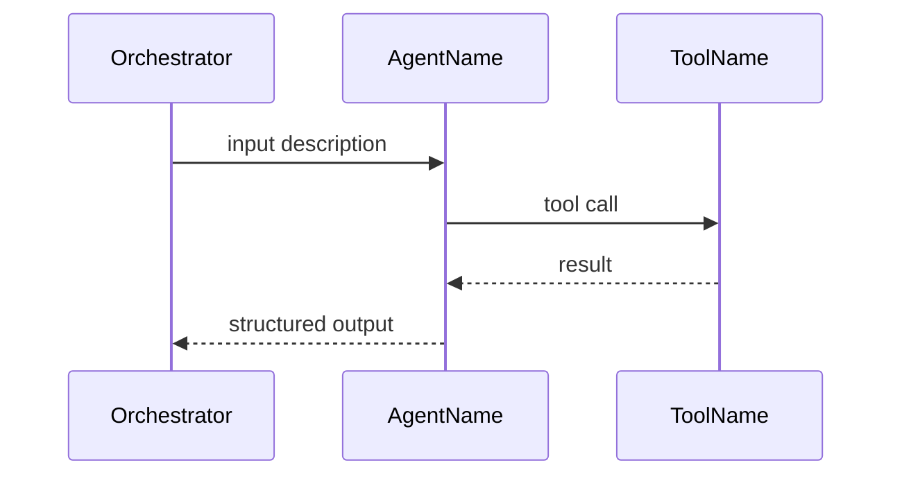

# Technical Design Guide

Template for writing `design.md` — the bridge between architecture (what to build) and code (how to build it). Every implementation phase starts by writing a design doc following this structure.

## When to Write

- Before starting any implementation phase
- When architecture.md defines WHAT, design.md defines HOW
- One design.md per project (append phase sections), or separate per-phase docs in `docs/`

## Format Rule

**Everything in Markdown.** Tables, lists, Mermaid diagrams. No TypeScript interfaces, no JSON examples, no code blocks for data schemas. These docs are read by AI and reviewed by humans — Markdown is the universal format for both.

Code blocks are only allowed for:
- Mermaid diagrams (```mermaid)
- CLI usage signatures (one-line `Usage: script.sh <arg>`)
- Shell commands in Data Flow narratives

## Template

### 1. Overview
One paragraph: what this phase/feature does, why it matters, which agents/components are involved. Reference `architecture.md` sections by name.

### 2. Scope

```markdown
**In scope**: [specific deliverables — be concrete]
**Out of scope**: [what this does NOT cover — prevents scope creep]
**Dependencies**: [what must exist before this works]
```

### 3. Data Flow
Mermaid sequence diagram showing the happy path. Include all agents, scripts, and external services.

```

```

Rules:
- Solid arrows for sync calls, dashed for async
- Label arrows with data being passed
- Include error paths for critical failures

### 4. State Schema
Describe every data structure in Markdown — tables for flat fields, nested lists for hierarchical data. Include file path patterns.

```markdown
#### MetricSnapshot
File: `projects/{product}/posts/{id}/metrics/snapshot-{date}.json`

| Field | Type | Description |
|-------|------|-------------|
| post_url | string | URL of the published post |
| scraped_at | string (ISO 8601) | When metrics were collected |

**metrics** (nested object):

| Field | Type | Description |
|-------|------|-------------|
| views | number | Total view count |
| likes | number | Total like count |
```

Rules:
- **Never use TypeScript, JSON, or code blocks** for schemas — always Markdown tables/lists
- Every field has a type and a description
- File path pattern shows where data lives on disk
- Show relationships between schemas (e.g., "Reply references Comment by `comment_id`")
- Use nested tables or indented lists for hierarchical objects
- Mark optional fields with "(optional)" in the Type column

### 5. Agent Interactions
Table showing execution order, agent, I/O, sync/async, and trigger condition.

```markdown
| Step | Agent | Input | Output | Sync/Async | Trigger |
|------|-------|-------|--------|------------|---------|
| 1 | Monitor | post URLs | metrics + comments | async | schedule.sh says due |
| 2 | Responder | classified comments | reply drafts | sync | actionable comments |
```

Include schedule/cadence logic if any agent runs periodically.

### 6. Scripts & Files
Table of every new or modified file.

```markdown
| File | Purpose | New/Modified |
|------|---------|-------------|
| `scripts/foo.sh` | Does X | New |
| `scripts/bar.sh` | Now also does Y | Modified |
```

For new scripts: show usage signature and brief description of steps.
For modified scripts: describe what changes and why.

### 7. Edge Cases
Bullet list of failure modes and how they're handled. Minimum 5.

```markdown
- **Service unavailable**: [what happens, how system recovers]
- **Invalid input**: [validation, error message]
- **Partial failure**: [what's saved, what's retried]
- **Auth expired**: [detection, user notification]
- **Rate limit**: [backoff strategy]
```

### 8. Acceptance Tests
Table of tests with clear pass/fail criteria. These become the E2E tests to write.

```markdown
| Test ID | Description | Pass Criterion |
|---------|-------------|----------------|
| T1.1 | Script X with input Y | Returns JSON with field Z > 0 |
| T1.2 | Agent A given bad input | Returns error, doesn't crash |
```

Rules:
- Test IDs use phase number prefix (T4.1, T4.2...)
- Each test is independently runnable
- Pass criterion is objectively verifiable (not "works correctly")

### 9. Open Questions
Anything unresolved. Number them. Mark priority (blocking vs nice-to-have).

```markdown
1. **[blocking]** How deep to scrape nested replies?
2. **[nice-to-have]** Should engagement rate exclude low-view posts?
```

---

## Rules

1. **Everything in Markdown** — tables, lists, Mermaid diagrams. No TypeScript, JSON, or code blocks for data schemas
2. **No implementation code** — only schemas (as tables), diagrams, and CLI signatures
3. **Reference architecture.md** — don't redefine agents or I/O contracts, link to them
4. **Design doc is living** — update it as implementation reveals changes
5. **Review before coding** — show to user, get approval, then implement
6. **One source of truth** — if design.md contradicts architecture.md, one must be updated

## Checklist

Before marking a design doc ready for implementation:

- [ ] Overview is one clear paragraph with architecture.md references
- [ ] Scope has explicit in/out boundaries
- [ ] Data flow covers the happy path with a Mermaid diagram
- [ ] State schemas are fully typed with file path patterns
- [ ] Agent interactions table is complete with triggers
- [ ] Every new/modified file is listed
- [ ] At least 5 edge cases documented with recovery strategies
- [ ] Acceptance tests have objectively verifiable pass criteria
- [ ] Open questions are numbered with priority labels
- [ ] No implementation code leaked into the design doc
- [ ] All schemas use Markdown tables — no TypeScript/JSON code blocks
