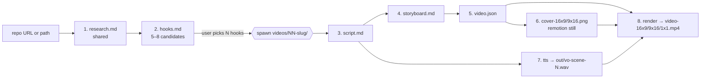

# repo-marketing-video — Design

> Status: **DRAFT — for discussion before implementation**

Generate a marketing video for a code repository through a **deterministic
pipeline of single-file artifacts**, each step transforming the previous
one. Each artifact is a markdown / JSON file that lives on disk so the
agent (and the user) can inspect, edit, re-run, and version it.

The video is rendered with **Remotion** using a small reusable template
that consumes the final `video.json`.

---

## 1. Pipeline Overview



Each arrow is a **deterministic transformation**: same input + same
template → same output. The agent re-runs only the steps downstream of
whatever the user edits.

### Properties

- **Resumable** — any step can be re-run alone if its input file changed.
- **Inspectable** — every intermediate is a human-readable file.
- **Editable** — user can hand-edit any artifact then resume from there.
- **Templated** — every step has an output template under
  `templates/<step>.md` that the agent fills in. This is the key to
  determinism: the agent does not improvise structure.
- **Gated** — after each step writes its output file, the skill **pauses
  and asks the user to review** before proceeding. The user can:
  - **Approve** → skill advances to next step
  - **Edit** → user hand-edits the artifact; skill re-hashes and continues
  - **Regenerate** → skill re-runs the same step (optionally with a steer
    note: "make it punchier", "drop scene 2", etc.)
  - **Stop** → skill exits cleanly; user resumes later by re-invoking
    the skill (it picks up from the last unapproved artifact)

---

## 2. Artifacts & Templates

Each step has **two** template files: a `*.prompt.md` (instructions to
the LLM, including constraints, style guide, examples) and a `*.md` (or
`*.schema.json`) **output skeleton** the LLM fills in. This split lets
us refine prompts independently of the output structure.

| # | Step       | Input                       | Output                  | Prompt                                | Skeleton                          |
|---|------------|-----------------------------|-------------------------|---------------------------------------|-----------------------------------|
| 1 | research   | repo URL / local path       | `research.md`           | `templates/01-research.prompt.md`     | `templates/01-research.md`        |
| 2 | hooks      | `research.md`               | `hooks.md`              | `templates/02-hooks.prompt.md`        | `templates/02-hooks.md`           |
| 3 | script     | `hooks.md` + `research.md`  | `script.md`             | `templates/03-script.prompt.md`       | `templates/03-script.md`          |
| 4 | storyboard | `script.md`                 | `storyboard.md`         | `templates/04-storyboard.prompt.md`   | `templates/04-storyboard.md`      |
| 5 | video.json | `storyboard.md`             | `video.json`            | `templates/05-video.prompt.md`        | `templates/05-video.schema.json`  |
| 6 | cover      | `video.json` (Hook scene props) | `cover-16x9.png` + `cover-9x16.png` | n/a (deterministic, `remotion still`) | uses `remotion/` Cover composition |
| 7 | tts        | `script.md`                 | `out/vo-scene-N.wav` (one per scene) | n/a                                   | `scripts/tts.sh` (edge-tts)       |
| 8 | render     | `video.json` + `out/vo-scene-*.wav` | `out/video-{16x9,9x16,1x1}.mp4` | n/a (deterministic)               | `remotion/` template project      |

### 2.1 `research.md`

Single source of truth about the repo **and its competitive landscape**.

Sections (filled by template):

- **Identity**: name, one-liner, tagline, GitHub URL, license, stars,
  primary language, last release, **`repo_type`** (one of:
  `ios-app` / `android-app` / `web-app` / `cli` / `library` /
  `chrome-extension` / `vscode-extension` / `other`) — used downstream
  to route the `demo-video` skill to the right capture backend.
- **Problem**: who hurts, why now, status quo.
- **Solution**: what the repo does, how it works in 1 paragraph.
- **Differentiators**: 3-5 bullets vs alternatives.
- **Competitors**: 3-5 named alternatives with one-liner each, plus a
  small comparison table (feature / price / DX / popularity). Sourced
  from web search + the repo's own README "alternatives" section if any.
- **Proof**: install/usage snippet, screenshot URLs, testimonials, metrics.
- **Audience**: ICP — who downloads this and why.
- **Brand**: voice (playful / authoritative / technical), color palette,
  tone references.

How filled: agent reads `README.md`, `package.json` / `pyproject.toml`,
top-level docs, recent issues/PRs, **plus a web search pass for
competitors**, then fills the template.

### 2.2 `hooks.md`

Top-of-funnel attention grabbers. **5–8 candidate hooks**, each scored.

Each hook has fields: `slug`, `text`, `style` (curiosity / pain /
contrarian / demo / stat), `score` (1-10 by predicted CTR),
`rationale`, `picked` (bool — has a video been spawned for this hook?).

**Multi-video flow**: hooks.md is the durable menu. The user picks one
or more hooks; each picked hook spawns a `videos/NN-<slug>/` directory
and the pipeline continues from step 3 inside that folder. The user can
revisit hooks.md later and pick another hook → it spawns a new video
without re-running steps 1–2.

### 2.3 `script.md`

The narration + on-screen copy. Structured as **scenes** (not
free-form prose) so step 4 is mechanical.

```
## Scene 1 — Hook
- voiceover: "<sentence>"
- on_screen: "<headline>"
- intent: hook the viewer

## Scene 2 — Problem
...
```

No target duration. Per-scene durations are computed at step 5 via the
auto-duration formula in §6.

### 2.4 `storyboard.md`

For each scene: visual treatment. **Layout-only** — no timestamps;
durations are computed at step 5.

```
## Scene 1
- visual: "terminal with $ <command> typing in"
- asset_hint: "screen recording OR animated terminal component"
- transition_in: fade           # one of: fade | cut | slide-left | slide-up | zoom
- transition_out: cut
- bgm_intensity: low            # one of: silent | low | mid | high
- caption_style: bold-bottom    # one of: bold-bottom | minimal-top | karaoke | none
```

This is the bridge between *what is said* and *what we render*. Step 5
resolves `asset_hint` to a concrete file path by searching
`.market/assets/demo/`, `.market/assets/`, and the repo's `README.md`
image references; if no match, it asks the user.

### 2.5 `video.json`

The deterministic render input — strict schema, no freeform prose. A
**single** `video.json` describes the video; the render step iterates
over `meta.aspects` and produces one `.mp4` per aspect ratio.

```json
{
  "meta": {
    "title": "...",
    "fps": 30,
    "aspects": ["16x9", "9x16", "1x1"],
    "duration": null            // computed at step 5 (sum of scene durations)
  },
  "voiceover": { "tts": "edge-tts", "voice": "en-US-AriaNeural" },
  "bgm": { "src": "../../assets/bgm.mp3", "baseVolume": 0.18 },
  "scenes": [
    {
      "id": "scene-1",
      "start": 0, "duration": 5,
      "component": "Hook",
      "props": {
        "headline": "...",
        "subhead": "...",
        "background": "../../assets/screenshot-1.png"
      },
      "voiceover":   { "audio": "out/vo-scene-1.wav" },
      "captions":    [{ "t": 0, "text": "..." }],
      "captionStyle":  "bold-bottom",
      "bgmIntensity":  "low",
      "transitionIn":  "fade",
      "transitionOut": "cut"
    }
  ]
}
```

**Voice selection** is derived in step 5 from `research.md` Brand
voice:

| Brand voice         | edge-tts voice           |
|---------------------|--------------------------|
| playful / friendly  | `en-US-AriaNeural`       |
| authoritative       | `en-US-ChristopherNeural`|
| technical / neutral | `en-US-GuyNeural`        |
| news / documentary  | `en-GB-SoniaNeural`      |

User can override after step 5 by hand-editing `video.json`.

Canvas dimensions per aspect (locked):

| Aspect | Width | Height |
|--------|------:|-------:|
| 16x9   | 1920  | 1080   |
| 9x16   | 1080  | 1920   |
| 1x1    | 1080  | 1080   |

### 2.6 Render

The Remotion project registers **three Main compositions** —
`Main16x9`, `Main9x16`, `Main1x1` — backed by the same `Main`
component but at the right canvas dimensions. Render loops over
`meta.aspects` and picks the matching composition ID:

```bash
cd <skill>/../remotion-engine/project
for aspect in 16x9 9x16 1x1; do
  npx remotion render src/index.ts "Main${aspect}" \
    "<repo>/.market/videos/${slug}/out/video-${aspect}.mp4" \
    --props="<repo>/.market/videos/${slug}/video.json" \
    --public-dir="<repo>/.market"
done
```

Covers (step 6) use a separate `Cover16x9` / `Cover9x16` composition
via `npx remotion still` — no external image API needed:

```bash
for aspect in 16x9 9x16; do
  npx remotion still src/index.ts "Cover${aspect}" \
    "<repo>/.market/videos/${slug}/cover-${aspect}.png" \
    --props="<repo>/.market/videos/${slug}/video.json" \
    --public-dir="<repo>/.market"
done
```

Both scripts run from inside `remotion-engine/project/` (the
shared Remotion project) with `--public-dir=<repo>/.market` so
asset paths in `video.json` resolve relative to the repo's `.market/`
directory.

---

## 3. Remotion Template

A **minimal, opinionated** Remotion project at
`remotion-engine/project/` (sibling skill) that:

- Registers **6 top-level compositions**: `Main16x9`, `Main9x16`,
  `Main1x1` (full videos at canvas-locked dimensions) plus
  `Cover16x9`, `Cover9x16` (still thumbnails). All read `video.json`
  via `--props`.
- Renders scenes in sequence using a **registry of scene components**
  (`Hook`, `Problem`, `Demo`, `Feature`, `Testimonial`, `CTA`,
  `Outro`, `Cover`).
- Each scene component has 3 layout variants (`16x9` / `9x16` /
  `1x1`) and reads aspect from a Remotion config context.
- BGM + per-scene voiceover layered via `<Audio>`.
- Captions via a single `Caption` component that **reads
  `scene.captionStyle`** and renders one of: `bold-bottom`,
  `minimal-top`, `karaoke`, `none`.

User can extend by adding a new scene component + registering it. The
storyboard step references components by name only — the **component
contract is the API**.

### First-time setup (`scripts/init-market.sh`)

When the skill runs against a repo for the first time:

1. `mkdir -p <repo>/.market/{assets,videos}`
2. Ensure the **shared** Remotion project at
   `remotion-engine/project/` has `node_modules/` (one-time install,
   reused across all repos that use this skill). The repo's `.market/`
   directory contains **artifacts only** — no Remotion install copy.
3. Suggest `.market/videos/*/out/*.wav` and `*.mp4` for `<repo>/.gitignore`.
   Everything else (`*.md`, `video.json`, `*.mp4`, `*.png`) is meant
   to be committed.

Idempotent: re-running skips steps that already produced their output.

---

## 4. Skill Layout

```
.github/skills/repo-marketing-video/
├── SKILL.md                       # main entry, references templates
├── design.md                      # this file
├── templates/
│   ├── 01-research.prompt.md
│   ├── 01-research.md             # output skeleton
│   ├── 02-hooks.prompt.md
│   ├── 02-hooks.md
│   ├── 03-script.prompt.md
│   ├── 03-script.md
│   ├── 04-storyboard.prompt.md
│   ├── 04-storyboard.md
│   ├── 05-video.prompt.md
│   ├── 05-video.schema.json       # JSON Schema for video.json
│   └── remotion/                  # cookiecutter Remotion project
│       ├── package.json
│       ├── src/
│       │   ├── index.tsx
│       │   ├── Main.tsx               # consumes video.json
│       │   └── scenes/
│       │       ├── Hook.tsx           # each scene has 16x9 / 9x16 / 1x1 layouts
│       │       ├── Cover.tsx          # static still composition for thumbnail
│       │       ├── Problem.tsx
│       │       ├── Demo.tsx
│       │       ├── Feature.tsx
│       │       ├── Testimonial.tsx
│       │       ├── CTA.tsx
│       │       └── Outro.tsx
│       └── README.md
└── scripts/
    ├── hash-frontmatter.sh        # compute sha256 for staleness check
    ├── init-market.sh             # first-time .market/ setup: copy remotion + npm install
    ├── spawn-video.sh             # picked hook → videos/NN-<slug>/ scaffold
    ├── tts.sh                     # edge-tts wrapper → out/vo-scene-N.wav (one per scene)
    └── render.sh                  # renders all 3 aspect ratios + still covers
```

## 5. Working Directory Convention — `<repo>/.market/`

All generated artifacts live under a **single hidden folder at the repo
root**. Research and hooks are **shared** across the repo; per-hook
folders hold the rest. **The Remotion project is NOT copied here** —
it lives at `remotion-engine/project/` (sibling skill) and is
shared across every repo that uses the skill (one `npm install` total).

```
<repo>/.market/
├── research.md                # shared, generated once
├── hooks.md                   # 5–8 candidate hooks, all retained
├── assets/                    # shared: logo, bgm, demo captures
│   ├── logo.png
│   ├── bgm.mp3
│   └── demo/                  # captures from the (future) `demo-video` skill
└── videos/
    ├── 01-<hook-slug>/        # one folder per hook the user picks
    │   ├── script.md
    │   ├── storyboard.md
    │   ├── video.json
    │   ├── cover-16x9.png
    │   ├── cover-9x16.png
    │   └── out/
    │       ├── vo-scene-1.wav
    │       ├── vo-scene-2.wav
    │       ├── …
    │       ├── video-16x9.mp4
    │       ├── video-9x16.mp4
    │       └── video-1x1.mp4
    ├── 02-<hook-slug>/
    │   └── ...
    └── ...
```

The render script `cd`s into `remotion-engine/project/`, reads the
per-video `video.json` via `--props=<repo>/.market/videos/01-<slug>/video.json`,
and uses `--public-dir=<repo>/.market` so asset paths like
`videos/01-<slug>/out/vo-scene-1.wav` resolve through `staticFile()`.
Outputs are written back into the per-video `out/` directory.
**One `npm install` (in the skill) services every repo and every video.**

- `hooks.md` keeps **all** candidates with their `picked: true|false`
  flag, so the user can come back later and pick another one to spin up
  a second video without re-running steps 1–2.
- `<hook-slug>` is a kebab-case slug derived from the hook text
  (e.g. `01-stop-paying-for-meeting-notes`).
- The `videos/NN-…` numeric prefix is the order in which videos were
  spawned, not a hook ranking.
- **Regenerating `hooks.md` never deletes existing `videos/NN-<slug>/`
  folders.** If a slug present on disk is missing from the new
  hooks.md, the skill flags it as `orphaned` (in a section at the
  bottom of hooks.md) but keeps the folder — user decides whether to
  delete or re-add the hook.
- **Gitignore policy** (skill prompts on first run):
  - ignore: `.market/videos/*/out/*.wav`, `.market/videos/*/out/*.mp4`
  - **commit**: every other artifact (`research.md`, `hooks.md`,
    `script.md`, `storyboard.md`, `video.json`, `cover-*.png`) so the
    marketing pipeline state lives with the repo.

---

## 6. Decisions

| # | Topic | Decision |
|---|-------|----------|
| 1 | Output location | All artifacts in `<repo>/.market/` (hidden, single gitignore entry) |
| 2 | TTS engine | `edge-tts` only (free, no key) |
| 3 | Aspect ratios | All three: **16:9, 9:16, 1:1** rendered from one storyboard |
| 4 | Duration | **Auto-derived** from script length & scene count (no fixed target) |
| 5 | Hook UX | Generate 5–8 candidates, **pause for user to pick one or more**; each picked hook spawns its own `videos/NN-<slug>/` |
| 6 | B-roll source | **No stock footage.** Visuals = repo screenshots + captures from the (future) `demo-video` skill + Remotion-rendered visuals |
| 7 | Re-run semantics | When upstream artifact changes, **auto-detect downstream staleness and ASK** before regenerating |
| 8 | Bundled examples | Skip in v1 |

### How aspect ratios work with one storyboard

The storyboard step writes **layout-agnostic** scene descriptions
(headline + subhead + visual asset + intent). Each Remotion scene
component has three layout variants (`16x9` / `9x16` / `1x1`) and
picks the right one from a `--props` flag. Render runs three times,
emitting `out/video-<ratio>.mp4`.

### How auto-duration works

- Step 3 (script) does not target a fixed length.
- Each scene's duration = `max(min_per_scene, words / wpm)` where
  `wpm ≈ 160` for narration, `min_per_scene = 2.5s`.
- Step 5 sums them into `meta.duration`.
- Soft warn if total > 120s; another warn if > 180s. **No hard fail** —
  the user is the editor.

### How staleness detection works

Each generated artifact starts with a YAML front-matter block. Paths
are **relative to the artifact's own directory** (so per-video
artifacts under `videos/NN-slug/` reference `../../research.md`):

```yaml
---
from: ../../research.md
from_hash: sha256:abcd...
generated_at: 2025-01-15T10:00:00Z
step: 3-script
---
```

On re-run, skill computes current hash of upstream artifact. If it
differs from `from_hash`, downstream is stale → skill prints a diff
summary and asks `Regenerate <step>? [y/N]`.

---

## 7. External Skill Dependencies

- **`demo-video`** (to be created separately) — produces screen captures /
  guided walkthroughs of the repo's product. Routed by `research.md`'s
  `repo_type` field: iOS → `app_agent`, web → `agent-browser`, CLI →
  `asciinema`-style. Outputs land in `<repo>/.market/assets/demo/` and
  are referenced by the storyboard step.
  - **v1 fallback**: if `demo-video` skill is not installed or the
    `repo_type` isn't supported, the storyboard step prompts the user
  to drop captures manually into `.market/assets/demo/`.
- **`free-bgm`** — used by step 4 (storyboard) to auto-find a fitting
  royalty-free BGM track based on `research.md` brand voice + scene
  intents. Output: `.market/assets/bgm.mp3`. If skill is unavailable,
  user is prompted to drop a file there manually.
- **`mermaid-diagrams`** — used by the storyboard step to render
  architecture/flow visuals as needed.
---

## 8. Non-Goals (v1)

- Multi-language voiceover (English only)
- Live preview server (use `npx remotion studio` manually)
- Auto-publishing to YouTube/X/LinkedIn (use `social-media-posting` skill)
- A/B testing hooks against real audience (offline scoring only)
- Bundled worked examples
